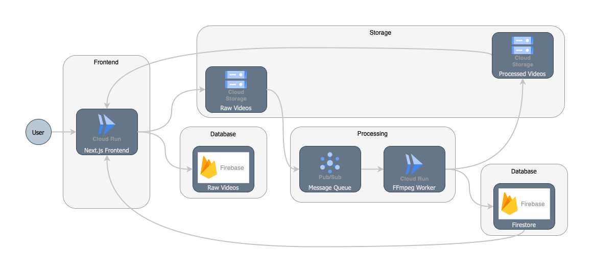

# ViewTube

A scalable video hosting service built with Google Cloud Platform and Next.js.

## Overview

ViewTube is a full-stack video hosting service that allows users to upload and watch videos. The service leverages Google Cloud Platform to handle video processing at scale. See it in action at https://vt-web-client-265437101019.us-central1.run.app.

## Architecture



The application utilizes several GCP services in a microservices architecture:

- **Frontend**: Next.js application hosted on Cloud Run
- **Authentication**: Firebase Authentication with Google Sign-In
- **Storage**: Google Cloud Storage for video files
- **Database**: Cloud Firestore for metadata and user information
- **Message Queue**: Cloud Pub/Sub for video processing events
- **Video Processing**: Cloud Run workers with FFmpeg
- **API Layer**: Firebase Functions

## Key Features

- Secure user authentication via Google Sign-In
- Scalable video upload handling with signed URLs
- Asynchronous video processing with FFmpeg
- Real-time video status updates
- Responsive web interface
- Cloud-native architecture with automatic scaling

## Technical Stack

### Backend
- TypeScript
- Express.js
- FFmpeg for video transcoding
- Google Cloud Platform
  - Cloud Storage
  - Cloud Pub/Sub
  - Cloud Run
  - Firebase Authentication
  - Cloud Firestore
  - Firebase Functions

### Frontend
- TypeScript
- React
- Next.js
- Tailwind CSS

## System Design

### Video Upload Flow
1. User authenticates and requests a signed URL
2. Client uploads directly to Cloud Storage
3. Upload triggers a Pub/Sub event
4. Cloud Run workers process the video
5. Processed video metadata is stored in Firestore

### Video Processing
- Asynchronous processing via message queue
- Automatic scaling based on workload
- Failed job handling and retry mechanism
- Progress tracking and status updates

## Getting Started

### Prerequisites
- Node.js 18+
- Docker Desktop
- FFmpeg installed locally for development
- Google Cloud Platform account with billing enabled
- Firebase project with Authentication and Firestore enabled

### Local Development
```bash
# Install dependencies
npm install

# Start development server
npm run dev
```

### Deployment
```bash
# Build the application
npm run build

# Deploy to Cloud Run
gcloud run deploy
```

## Future Enhancements

- Add user's profile picture and email to Web Client
- (Bug fix) Allow users to upload multiple videos without refreshing the page
- Allow users to upload thumbnails for their videos
- Allow users to add a title and description to their videos
- Show the uploader of a video
- Clean up raw videos in Cloud Storage after processing
- Use a CDN to serve videos
- Add unit and integration tests